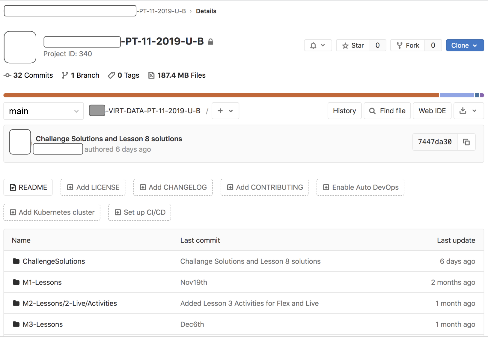
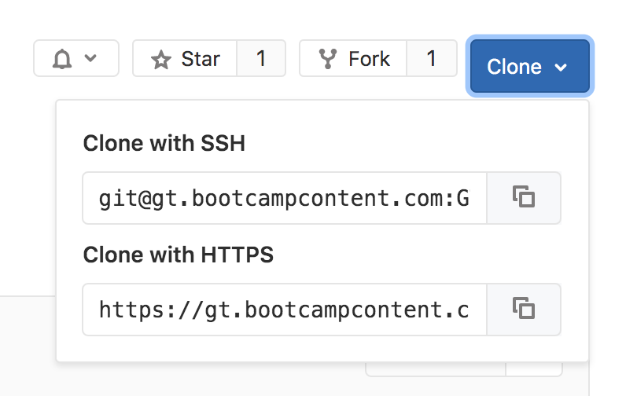

# 1.6.1 Class Repository (GitLab) Guide
We've already covered how you'll use Canvas, Slack, and Zoom to navigate the boot camp. There's another tool that you'll use in and out of the classroom that's just as important. GitLab is a platform that will host a **repository** specific to your class.

**NOTE**:
> Your university might use **GitHub** instead of **GitLab** to host your class repository. The following explanations of the class repository still apply.

## What Is the Class Repository on GitLab?
You can think of the class repository on GitLab as a textbook for the course. Just like how you have a platform that holds all of your asynchronous content, your class repository will hold all of your class content. This means that any activities that you’ll go through during class will be stored here, ready for you to download!

If you haven’t already received your class repository link, don’t worry—you’ll get it soon!

This is what a class repository looks like after it has a few modules added:

## Is GitLab the Same as GitHub?
Even though GitLab and GitHub can serve similar purposes, for the duration of this course, these platforms may be used to accomplish different things.

GitHub will be the platform that we use throughout the course to host your projects and course assignments. It will give you the ability to continually update your work and collaborate with others.

## What Is Git?
GitLab and GitHub both use Git as a form of version control. You’ll learn more about this later in the course, but it’s a way to record changes to files over time, especially if you have multiple people working on those files.

## How Do I Get the Content from My Class Repository?
As your instructional staff updates the repository, you’ll see new activities appear when you're logged in. If you want the files on your machine, you’ll have to clone them or "pull" (Git terminology!) updates.

**NOTE**:
> This is covered in the course, but make sure to come back to these instructions if you ever need some additional help.

### Clone the Repository for the First Time

**NOTE**:
> Setting up SSH is covered in the prework. Cloning a repo is explained during the course.

1. In your computer’s terminal or GitBash, navigate to a directory in which you want to store the class repository.

2. Click **Clone** in the upper right corner of the class repository:

3. Copy the SSH link if your SSH key is set up. If not, you can use HTTPS but will need to input your GitHub credentials while cloning. Make sure to connect with your instructional staff if you need help setting up your SSH key.

4. In the terminal or GitBash, type **git clone "link you just copied"**

You’ve now cloned the repository onto your machine!

### Update Your Local Repository
As your instructional staff updates the repository, you’ll want to keep your local copy updated. To do that, follow these instructions:

1. Navigate into your local copy of the class repository on your terminal or GitBash.

2. Use the command **git pull origin main**

Your local repository should now be updated and will have pulled all the latest changes from the main branch. If you run into issues here, consult with your instructional staff or reclone the repo.

## Quick Tips
* If you write directly to the files you pull from the class repo, you might end up with a few merge conflicts that result from overwriting your work with new updates. Feel free to make copies of files and store them in another folder so you can work more freely.

* Make sure to save your username and password somewhere safe. GitLab password resets can take some time to process.

---
© 2022 Trilogy Education Services, LLC, a 2U, Inc. brand. Confidential and Proprietary. All Rights Reserved.