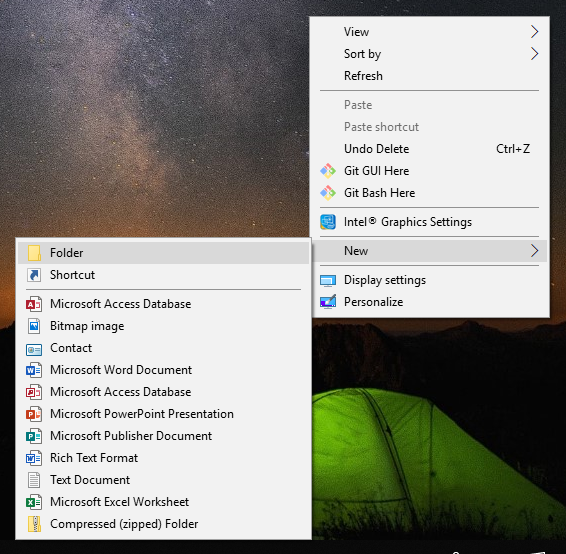
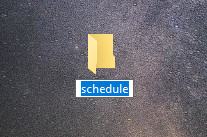
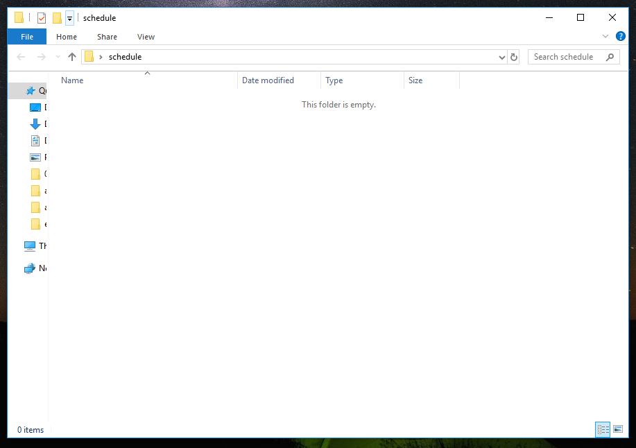
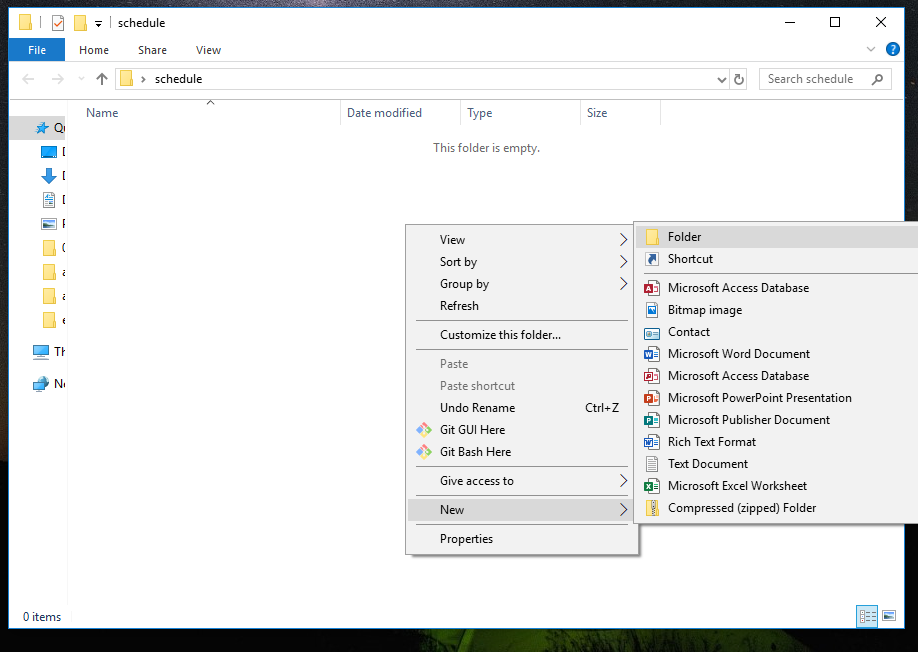
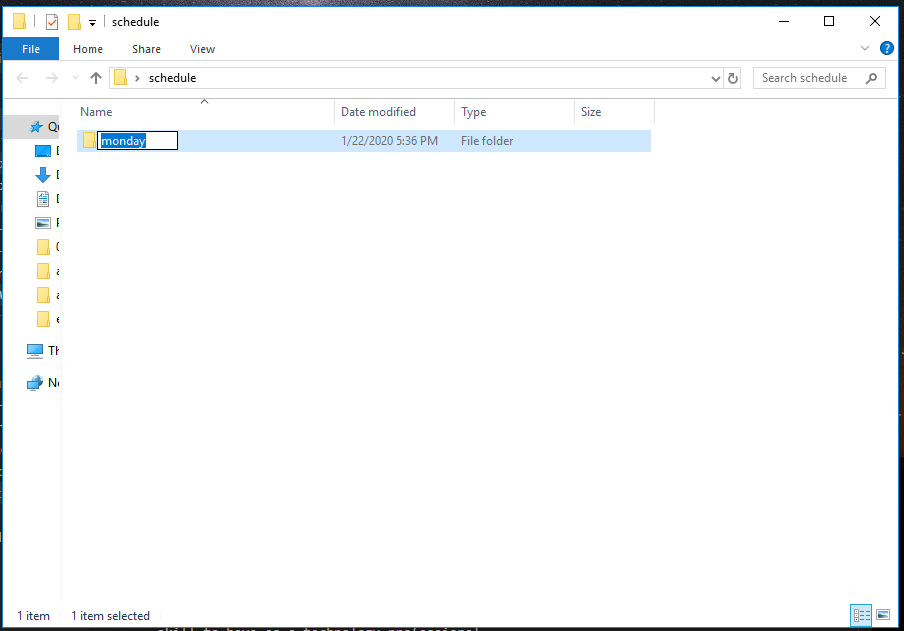
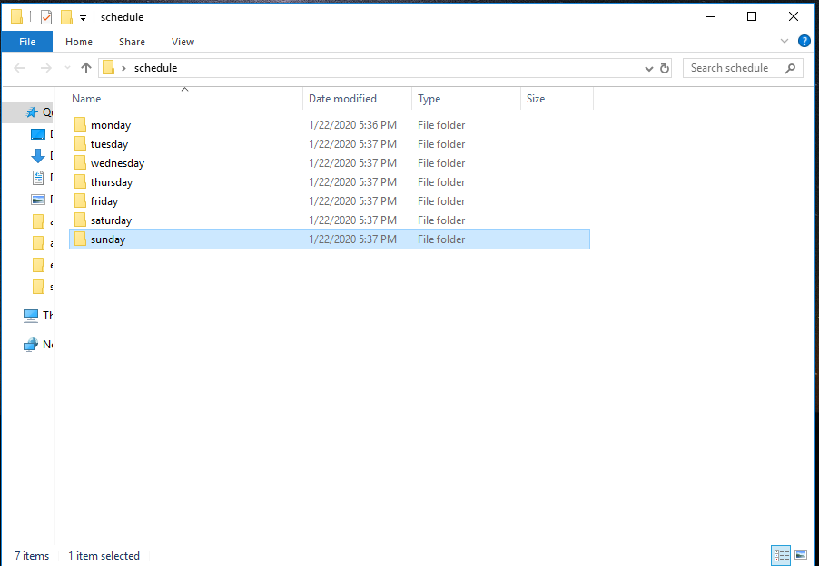

# 1.7.1 Computer Basics

During this course, you'll use your desktop or laptop computer a lot. We all have varying degrees of comfort in this environment. Knowing how to maneuver within the desktop, files, and folders is essential to succeeding in this course, and keyboard shortcuts can speed up your work considerably.

For those who need an orientation or refresher, we've compiled a review of the following computer basics:

* The desktop

* Files and folders

* Folder structure

* Keyboard shortcuts

## The Desktop

The **desktop** is the main screen that you see when you turn on your computer. You can think of it as the home screen for your computer, and it behaves much like a folder. In fact, it is a folder; the computer just displays its contents in a unique way.

The desktop allows for quick access to commonly used files, folders, and shortcuts to programs. It typically includes a background image or some sort of wallpaper, and icons (small representative images) of files, folders, and programs that you've saved there. There are also usually menus of applications located at the bottom or top of the screen.

The desktop will appear as long as you don't have an application, like a web browser, or a file filling up the entire screen.

## Files and Folders

There are two primary ways of storing information on your computer: **files** and **folders**.

A file is a distinct resource that stores a specific type of data, such as an image, typed text, a video, or a computer program. You're probably familiar with some common file endings, such as `.jpg` or `.png` for images, `.txt` for a text file, .docx for a Word document, `.mp3` for an audio file, or `.mp4` for a video file. These endings are known as **file extensions**, and every distinct type of file has a distinct extension.

A **folder**, also known as a **directory**, is a way to organize various files. It's a storage space where files can be grouped together and organized. A folder can also contain other folders inside it. Folders are an extremely useful and common way to organize all of the data on your computer and in computer programs.

## Folder Structure

As we mentioned earlier, folders can exist inside other folders. This nested structure allows you to organize your files in deliberate ways. Let's take a look at this together.

To start, go to your desktop. Remember that your desktop acts like a folder. It's like a folder at the top level of what you want to organize.

Once you're at your desktop, right-click to open a menu. If you're on Windows, click New and then Folder. If you're on a Mac, simply select New Folder. The following image shows what this looks like on a Windows desktop:

This creates a folder icon on your desktop. You can name it whatever you'd like. For our purposes, let's name it `schedule`:

Once you've named your folder, open it by double-clicking on it. You should see an empty folder open on your screen:

Place your cursor onto the empty space and right-click again to create another new folder inside `schedule` (a folder that's inside another folder is called a **subfolder** or **subdirectory**):

We'll call this folder `monday`:

Place your cursor on the empty space inside the `schedule` folder and right-click again to create another new folder. We'll call this one `tuesday`. Repeat this action until you have a folder for each day of the week inside the `schedule` folder. It should look like the following image:

You can now double-click to open any of these folders. Inside them, you can store files and/or other folders. Deliberately organizing your files and folders is an important skill to have as a technology professional—and in everyday life!

## Keyboard Shortcuts

Most of us use our mouse or trackpad to navigate the screen, but for technology professionals, it's often faster and more convenient to use keyboard shortcuts. Most of these shortcuts use either the Ctrl (command on Macs), Alt, or Shift keys in combination with a letter key. We'll outline some of the most common ones below.

## Copy and Paste

You've probably had the experience of copying a sentence or two from an article or email and pasting it into another email or document. Maybe you used the mouse to highlight the sentence, then right-clicked to copy, and right-clicked again to paste the sentence to its new location. Or maybe you chose Copy from the Edit menu in an application. There are several ways to do this.

The quickest way is by using keyboard shortcuts. On Windows, you can use the combination of Ctrl+C to copy text. To do this, highlight the text you want to copy, then hold down the Ctrl key and then press the C key while still holding down Ctrl. This will copy the highlighted text to the clipboard, which is an invisible-to-you space on your computer that stores information that you copy or cut.

To paste the copied text, you can use the combination of Ctrl+V. Place your cursor where you want to paste the highlighted text, then hold down the Ctrl key and press the V key while still holding down Ctrl. This will paste the highlighted text into its new location.

On a Mac, you'll do exactly the same as above, but you'll use the command key instead of Ctrl.

## Cut and Paste

Cutting text is similar to copying text. The main difference is that cutting will actually remove the text from the document or email. This is helpful if you don't want a word or sentence to be in one place in a document but you do want it in another spot.

On Windows, you can use the combination of Ctrl+X to cut text. Once you've highlighted the text you want to copy, hold down the Ctrl key and then press the X key while still holding down Ctrl. This will cut the highlighted text.

To paste the highlighted text, you will again use the combination of Ctrl+V. Place your cursor where you want to paste the highlighted text, then hold down the Ctrl key and press the V key while still holding down Ctrl. This will paste the highlighted text into its new location.

On a Mac, you'll do exactly the same as above, but you'll use the command key instead of Ctrl.

You can also use these shortcuts with files and folders, using the exact same combinations above. This will speed up the way you organize your files and programs, as you cut a file from one folder and paste it inside another.

## Other Keyboard Shortcuts

There many handy keyboard shortcuts out there that can become second nature to you after you use them enough. For example, you can use Ctrl+T to open a new tab in a browser. To learn more about these, google "keyboard shortcuts".

---
© 2022 Trilogy Education Services, LLC, a 2U, Inc. brand. Confidential and Proprietary. All Rights Reserved.